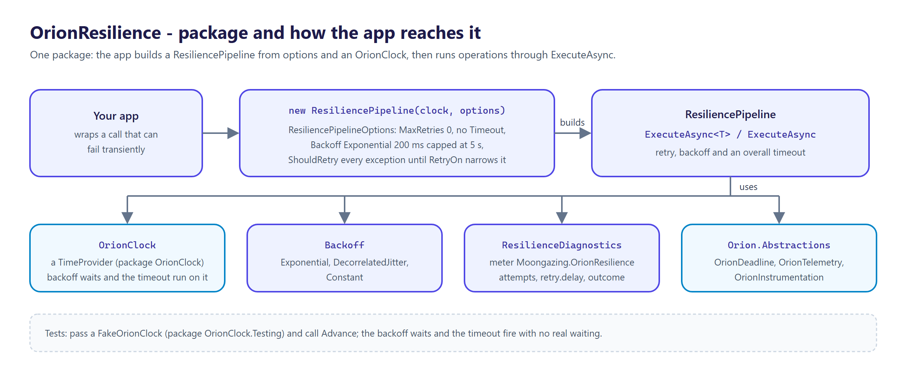
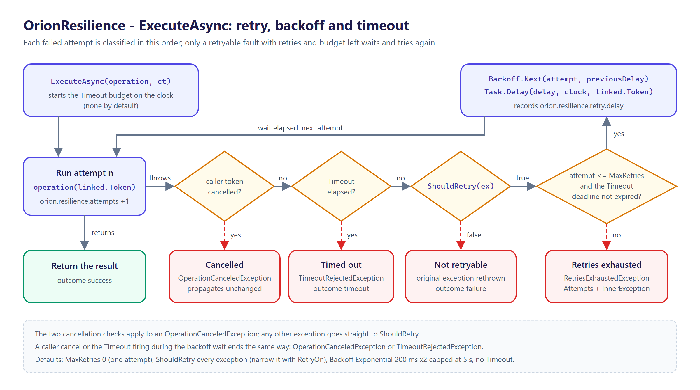

<p align="center">
  <picture>
    <source media="(prefers-color-scheme: dark)" srcset="docs/logo.png">
    
  </picture>
</p>

# OrionResilience

[](https://github.com/tunahanaliozturk/OrionResilience/actions/workflows/ci-cd.yml)
[](https://www.nuget.org/packages/OrionResilience/)
[](LICENSE)


One opinionated resilience vocabulary for the **Orion** family: retry with jitter presets and an overall timeout, executed over an `OrionClock` `TimeProvider` so every retry fast-forwards in tests, with OpenTelemetry by default and configured through options — not fluent chains.

Backoff is the most re-implemented 40 lines in any backend. Webhook delivery has its own exponential-backoff-with-jitter, lease acquisition has another, and every `HttpClient` caller writes a `for` loop with `Task.Delay`. They disagree on the base delay, the jitter algorithm, the cap, and what counts as retryable — and none of them are testable, because the delay is a real `Task.Delay` against the real clock, so the retry test either sleeps for real or doesn't exist.

OrionResilience is the opinionated preset layer. Retries and the timeout run on the family's [`OrionClock`](https://github.com/tunahanaliozturk/OrionClock), so the same fake clock that fast-forwards leases and TTLs fast-forwards a whole retry sequence — a 4-retry pipeline with a 5-second cap completes in-test in microseconds. Every execution emits the family's `orion.*` OpenTelemetry signals.



## Features

- **Retry + timeout on `OrionClock`** — all delays and the overall timeout run on the clock's `TimeProvider`. Under `FakeOrionClock` a retry sequence fast-forwards deterministically; no real waits, no flaky "wait for it" tests.
- **`Backoff` presets** — `Exponential` (configurable factor), `DecorrelatedJitter` (overflow-safe, injectable sampler for deterministic tests), and `Constant`. `Exponential` and `Constant` take an optional cap; `DecorrelatedJitter` requires one.
- **Declared retryability** — `RetryOn<TException>()` and `RetryOn(predicate)`, OR-composed; by default every exception is retryable until you narrow it. Retrying a non-idempotent operation is the caller's declared choice.
- **Typed failures** — `TimeoutRejectedException` (distinct from caller cancellation, which always propagates unchanged) and `RetriesExhaustedException` (carries the attempt count, wraps the last fault).
- **OpenTelemetry by default** — a `Moongazing.OrionResilience` meter/activity-source carrying `orion.resilience.attempts`, `orion.resilience.retry.delay` (ms), and `orion.resilience.outcome` (tagged with a frozen outcome), plus an execution span. Built on the family's `OrionInstrumentation` spine, so multi-tenant / multi-region labels stamp every measurement.
- **AOT- and trim-clean**, verified by a native-binary smoke test in CI. Multi-targets `net8.0`, `net9.0`, `net10.0`.

## Install

```bash
dotnet add package OrionResilience
```

| Package | What it is |
|---------|------------|
| `OrionResilience` | `ResiliencePipeline`, `ResiliencePipelineOptions`, `Backoff`, `TimeoutRejectedException`, `RetriesExhaustedException` and `ResilienceDiagnostics`. Depends on `Orion.Abstractions` and `OrionClock`. |

## Quick start

```csharp
using Moongazing.OrionClock;
using Moongazing.OrionResilience;

var clock = new OrionClock(); // the family clock; in DI, resolve OrionClock (registered by AddOrionClock)

var pipeline = new ResiliencePipeline(clock, new ResiliencePipelineOptions
{
    MaxRetries = 4,                                                  // 1 initial attempt + 4 retries
    Backoff = Backoff.DecorrelatedJitter(
        baseDelay: TimeSpan.FromMilliseconds(200),
        cap: TimeSpan.FromSeconds(5)),
    Timeout = TimeSpan.FromSeconds(10),                             // overall budget for all attempts
}.RetryOn<HttpRequestException>()                                   // only these are retryable
 .RetryOn<TimeoutException>());

HttpResponseMessage response = await pipeline.ExecuteAsync(
    async ct => await httpClient.SendAsync(request, ct),
    cancellationToken);
```

`ExecuteAsync` returns the operation's result on success. It throws `TimeoutRejectedException` when the budget elapses, and `RetriesExhaustedException` (wrapping the last fault) when an attempt fails with a retryable exception and no retry or `Timeout` budget is left. An exception that `ShouldRetry` rejects is rethrown unchanged. A caller-driven `OperationCanceledException` always propagates unchanged — it is never reclassified as a timeout.



### Options

`ResiliencePipelineOptions`:

| Option | Default | Meaning |
|--------|---------|---------|
| `MaxRetries` | `0` | Retries after the first attempt; total attempts are `1 + MaxRetries`. With `0`, a retryable failure ends in `RetriesExhaustedException` after one attempt. |
| `Backoff` | `Backoff.Exponential(200 ms, cap: 5 s)` | The delay before each retry (factor 2). |
| `Timeout` | `Timeout.InfiniteTimeSpan` | Overall budget for all attempts and their waits. Must be positive or infinite. |
| `ShouldRetry` | every exception | Retryability predicate. The first `RetryOn<TException>()` / `RetryOn(predicate)` call replaces the default; later calls OR onto it. |

## Testing — retries fast-forward, no real waits

Point the pipeline at `FakeOrionClock` and advance time by hand. Because the backoff `Task.Delay` and the timeout `CancellationTokenSource` are both created through the clock's `TimeProvider`, advancing the clock fires them — the whole retry sequence runs instantly and deterministically.

```csharp
using Moongazing.OrionClock.Testing;

var clock = new FakeOrionClock();
var pipeline = new ResiliencePipeline(clock, new ResiliencePipelineOptions
{
    MaxRetries = 4,
    Backoff = Backoff.Exponential(TimeSpan.FromMilliseconds(200), cap: TimeSpan.FromSeconds(5)),
});

var attempts = 0;
var execution = pipeline.ExecuteAsync(async ct =>
{
    if (++attempts < 5) throw new InvalidOperationException("transient");
    await Task.CompletedTask;
    return "ok";
});

// Drive the scheduled backoff waits by advancing the clock, not by sleeping.
while (!execution.IsCompleted) clock.Advance(TimeSpan.FromMilliseconds(500));

Assert.Equal("ok", await execution); // recovered after 4 retries, in microseconds
```

Pair it with `DeterministicFaultInjector` (from `Orion.Abstractions.Testing`) to model a dependency that fails a fixed number of times, or recovers at a known instant, with no randomness.

## Observability

Every execution records to a `Moongazing.OrionResilience` meter and activity source:

| Signal | Kind | Meaning |
|---|---|---|
| `orion.resilience.attempts` | counter | Individual attempts executed (including the first). |
| `orion.resilience.retry.delay` | histogram (ms) | The backoff waited before each retry, tagged `orion.attempt` with the 1-based attempt that failed. |
| `orion.resilience.outcome` | counter | Completed executions, tagged `orion.outcome` = `success` / `failure` / `timeout` / `cancelled`. |

Each `ExecuteAsync` call is one `OrionResilience.execute` span, tagged with the outcome and the final attempt count. Telemetry emits by default through a shared instance. Hand a `ResilienceDiagnostics` you own to the pipeline constructor when you want DI-managed lifetime or per-instance scoping.

## Roadmap

Wave 1 (this release) ships retry + timeout on `OrionClock`, the jitter presets, and OpenTelemetry, AOT-clean. Circuit-breaker and hedging, `OrionResult`-typed errors, options-configured named pipelines (`services.AddOrionResilience(...)`), and typed-`HttpClient` integration land in later waves. See [CHANGELOG.md](CHANGELOG.md).

OrionResilience curates and integrates proven strategies rather than inventing new ones; it is the family's opinionated *preset* layer, not a new resilience engine, and it is not a rate limiter or bulkhead (those compose from elsewhere in the family).

## Versioning

Follows [Semantic Versioning](https://semver.org/). Multi-targets `net8.0`, `net9.0`, and `net10.0`. Binds to `Orion.Abstractions` 1.x and `OrionClock` 0.9.x.

## Documentation

- [CHANGELOG.md](CHANGELOG.md) — release notes.

## Contributing

Contributions are welcome. See [CONTRIBUTING.md](CONTRIBUTING.md) and the [CODE_OF_CONDUCT.md](CODE_OF_CONDUCT.md).

## More from the Orion family

Focused .NET libraries built to one quality bar. Each is usable on its own; several share the small [`Orion.Abstractions`](https://github.com/tunahanaliozturk/Orion.Abstractions) contracts spine, but there is no deep dependency web — pick only what you need:

- [Orion.Abstractions](https://github.com/tunahanaliozturk/Orion.Abstractions) — the shared contracts spine: telemetry, options, result, clock
- [OrionClock](https://github.com/tunahanaliozturk/OrionClock) — a `TimeProvider`-based clock with TTL / deadline vocabulary
- [OrionGuard](https://github.com/tunahanaliozturk/OrionGuard) — validation, guard clauses, DDD primitives, domain events
- [OrionAudit](https://github.com/tunahanaliozturk/OrionAudit) — automatic EF Core change-audit trail
- [OrionBeacon](https://github.com/tunahanaliozturk/OrionBeacon) — leader election with fencing tokens
- [OrionGrant](https://github.com/tunahanaliozturk/OrionGrant) — permission / authorization checks
- [OrionKey](https://github.com/tunahanaliozturk/OrionKey) — source-generated strongly-typed IDs
- [OrionLedger](https://github.com/tunahanaliozturk/OrionLedger) — API-key issuance, verification, and rotation
- [OrionLens](https://github.com/tunahanaliozturk/OrionLens) — ambient correlation-context propagation
- [OrionLock](https://github.com/tunahanaliozturk/OrionLock) — distributed locks with fencing tokens
- [OrionOnce](https://github.com/tunahanaliozturk/OrionOnce) — idempotency keys for exactly-once request handling
- [OrionPatch](https://github.com/tunahanaliozturk/OrionPatch) — transactional outbox for EF Core
- [OrionRelay](https://github.com/tunahanaliozturk/OrionRelay) — outbound webhook delivery (HMAC, retries, backoff)
- [OrionResult](https://github.com/tunahanaliozturk/OrionResult) — Result/Option types and a shared error vocabulary
- [OrionSaga](https://github.com/tunahanaliozturk/OrionSaga) — sagas / process managers for long-running workflows
- [OrionShade](https://github.com/tunahanaliozturk/OrionShade) — sensitive-data redaction for logs and telemetry
- [OrionStream](https://github.com/tunahanaliozturk/OrionStream) — server-sent events / streaming hub
- [OrionVault](https://github.com/tunahanaliozturk/OrionVault) — field-level encryption for EF Core

See it all working together in [OrionShowcase](https://github.com/tunahanaliozturk/OrionShowcase), a production-shaped banking sample.

## License

[MIT](LICENSE).
